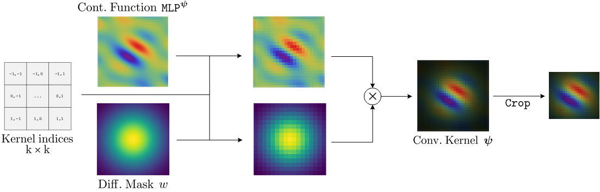

## FlexConv: Continuous Kernel Convolutions with Differentiable Kernel Sizes

This repository contains the source code accompanying the paper:

[FlexConv: Continuous Kernel Convolutions with Differentiable Kernel Sizes](https://arxiv.org/abs/2110.08059)  [[Slides]](https://app.slidebean.com/p/ef4087axxj/FlexConvs-Continuous-Kernel-Convolutions-with-Differentiable-Kernel-Sizes) [[Poster]](presentation/poster.pdf) <br/>**[David W. Romero*](https://www.davidromero.ml/), [Robert-Jan Bruintjes*](https://rjbruin.github.io), [Jakub M. Tomczak](https://jmtomczak.github.io/), [Erik J. Bekkers](https://erikbekkers.bitbucket.io/), [Mark Hoogendoorn](https://www.cs.vu.nl/~mhoogen/) & [Jan C. van Gemert](https://jvgemert.github.io)**.

[](https://paperswithcode.com/sota/sequential-image-classification-on-noise?p=flexconv-continuous-kernel-convolutions-with-1)
[](https://paperswithcode.com/sota/sequential-image-classification-on-sequential-1?p=flexconv-continuous-kernel-convolutions-with-1)
[](https://paperswithcode.com/sota/sequential-image-classification-on-sequential?p=flexconv-continuous-kernel-convolutions-with-1)
[](https://paperswithcode.com/sota/time-series-on-speech-commands?p=flexconv-continuous-kernel-convolutions-with-1)


#### Abstract
*When designing Convolutional Neural Networks (CNNs), one must select the size of the convolutional kernels before training. Recent works show CNNs benefit from different kernel sizes at different layers, but exploring all possible combinations is unfeasible in practice. A more efficient approach is to learn the kernel size during training. However, existing works that learn the kernel size have a limited bandwidth. These approaches scale kernels by dilation, and thus the detail they can describe is limited. In this work, we propose FlexConv, a novel convolutional operation with which high bandwidth convolutional kernels of learnable kernel size can be learned at a fixed parameter cost. FlexNets model long-term dependencies without the use of pooling, achieve state-of-the-art performance on several sequential datasets, outperform recent works with learned kernel sizes, and are competitive with much deeper ResNets on image benchmark datasets. Additionally, FlexNets can be deployed at higher resolutions than those seen during training. To avoid aliasing, we propose a novel kernel parameterization with which the frequency of the kernels can be analytically controlled. Our novel kernel parameterization shows higher descriptive power and faster convergence speed than existing parameterizations. This leads to important improvements in classification accuracy.*



### Repository structure

This repository is organized as follows:

* `ckconv` contains the main PyTorch library of our model.

* `models` and `datasets` contain the models and datasets used throughout our experiments;

* `cfg` contains the default configuration of our `run_*.py` scripts, in YAML. We use Hydra with OmegaConf to manage the configuration of our experiments.

* `experiments` contains commands to replicate the experiments from the paper.

* `ckernel_fitting` contains source code to run experiments to approximate convolutional filters via MLPs. Please see `ckernel_fitting/README.md` for further details.

### Using the code

Image classification experiments are run with `run_experiment.py`. Cross-resolution image classification experiments are run with `run_crossres.py`, which trains on the source resolution for `train.epochs` epochs, before finetuning on the target resolution for `cross_res.finetune_epochs` epochs. The code can also be profiled using PyTorch's profiling tools with `run_profiler.py`.

Flags are handled by [Hydra](https://hydra.cc/docs/intro). See `cfg/config.yaml` for all available flags. Flags can be passed as `xxx.yyy=value`.

#### Useful flags

- `net.*` describes settings for the FlexNet models (model definition `models/ckresnet.py`).
- `kernel.*` describes settings for the MAGNet kernel generators in FlexConvs, for any model definition that uses FlexConvs.
- `kernel.regularize_params.*` describes settings for the anti-aliasing regularization.
  - `target=gabor` regularizes without the FlexConv Gaussian mask; `target=gabor+mask` regularized including the FlexConv mask.
- `mask.*` describes settings for the FlexConv Gaussian mask.
- `conv.*` describes settings for the convolution to use in FlexNet, excluding MAGNet settings. Can be used to switch between FlexConv, CKConv and regular Conv.
- `debug=True`: By default, all experiment scripts connect to Weights & Biases to log the experimental results. Use this flag to run without connecting to Weights & Biases.
- `pretrained` and related flags: Use these to load checkpoints before training, either from a local file (`pretrained` and `pretrained_params.filepath`) or from Weights & Biases (`pretrained_wandb` and associated flags).
  - In cross-res training, flags can be combined to fine-tune from an existing source res model. Pre-load the final model trained at source resolution (by specifying the correct file), and set `train.epochs=0` so source res training is skipped.
- `train.do=False`: Only test the model. Useful in combination with pre-training.
  - Note that this flag doesn't work in cross-res training.

### Install

#### conda *(recommended)*
In order to reproduce our results, please first install the required dependencies. This can be done by:
```
conda env create -f conda_requirements.yaml
```
This will create the conda environment `flexconv` with the correct dependencies.

#### pip
The same conda environment can be created with `pip` by running:
```
conda create -n flexconv python=3.8.5
conda install pytorch==1.9.0 torchvision==0.10.0 torchaudio=0.9.0 cudatoolkit=10.2 -c pytorch
conda activate flexconv
pip install -r requirements.txt
```

### Reproducing experiments

Please see [the Experiments readme](experiments/readme.md) for details on reproducing the paper's experiments, including checkpoints for selected models.

### Cite
If you found this work useful in your research, please consider citing:

```
@misc{romero2021flexconv,
      title={FlexConv: Continuous Kernel Convolutions with Differentiable Kernel Sizes}, 
      author={David W. Romero and Robert-Jan Bruintjes and Jakub M. Tomczak and Erik J. Bekkers and Mark Hoogendoorn and Jan C. van Gemert},
      year={2021},
      eprint={2110.08059},
      archivePrefix={arXiv},
      primaryClass={cs.CV}
}
```

### Acknowledgements

We thank Nergis Tömen for her valuable insights regarding signal processing principles for FlexConv, and Silvia-Laura Pintea for explanations and access to code of her work (Pintea et al., 2021). We thank Yerlan Idelbayev for the use of the [CIFAR ResNet code](github.com/akamaster/pytorch_resnet_cifar10).

This work is supported by the [Qualcomm Innovation Fellowship (2021)](https://www.qualcomm.com/research/research/university-relations/innovation-fellowship/2021-europe) granted to David W. Romero. David W. Romero sincerely thanks Qualcomm for his support. David W. Romero is financed as part of the Efficient Deep Learning (EDL) programme (grant number P16-25), partly funded by the Dutch Research Council (NWO). Robert-Jan Bruintjes is financed by the Dutch Research Council (NWO) (project VI.Vidi.192.100). All authors sincerely thank everyone involved in funding this work.

This work was partially carried out on the Dutch national infrastructure with the support of SURF Cooperative. We used [Weights & Biases](https://wandb.ai/site) for experiment tracking and visualization.
